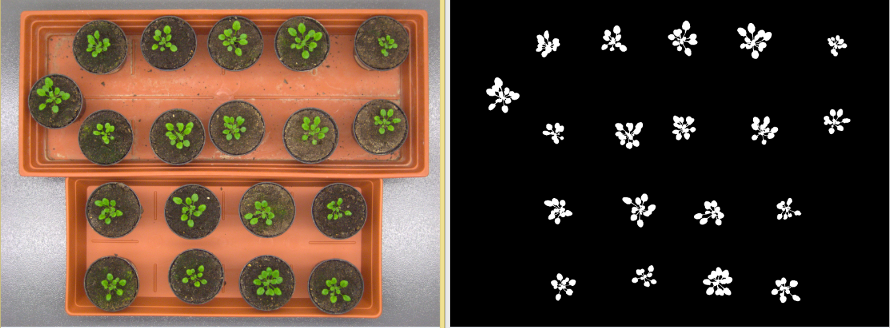
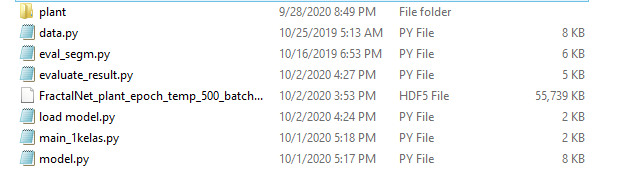
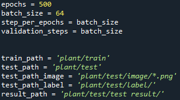
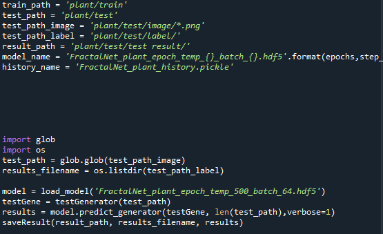
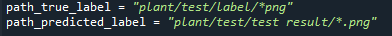

# Binary-segmentation

This is an implementation of Plant segmentation using deep learning fractal-net on Python 3. This code generates masking in every objects in one image.

The repository includes:
* Source code of plant segemtation using deep learning fractal net.
* using Spyder IDE to visualize important step.
* Example of training on your own dataset (training)
* Example how to test our dataset (testing)
* evaluate the result 

# Getting Started
* open colour load_model.py in the main page  Is the easiest way to start. It shows an example of plant segmentation. (testing only)
* open main_1kelas.py in the main page, this codes for training (training)

# Step to train  with your own data

## 1. Prepare dataset and make sure the path 
just put dataset in your main path. Make sure u put the data and codes like my picture below!
dataset : https://drive.google.com/file/d/1lEG74V3n4e59mIIGQHxKV3P8J9cg39fQ/view?usp=sharing

## 2. train own dataset
This example will explain which part u must change to train your own dataset.open code with name 1main_kelas.py 
just change how many epoch u want and make sure your path is right. 

## 3. Execute program (1main_kelas.py) 
press F5.

# Step to testing 

## 1. prepare own model (weight/hdf5)
just put dataset in your main path. Make sure u put the data and codes like my picture below!

dataset : https://drive.google.com/file/d/1zJHNGNyhGoO7oA3PEGDSjTz00eFRdor0/view?usp=sharing

## 2. test own dataset
open load model.py code, then make sure the path is right and name of the model too.

## 3.Execute program
press F5

# Step to evaluate the model

## 1. evaluate model
open evaluate_result.py, then make sure again about the label and predict path.

## 2.Execute program
press F5
